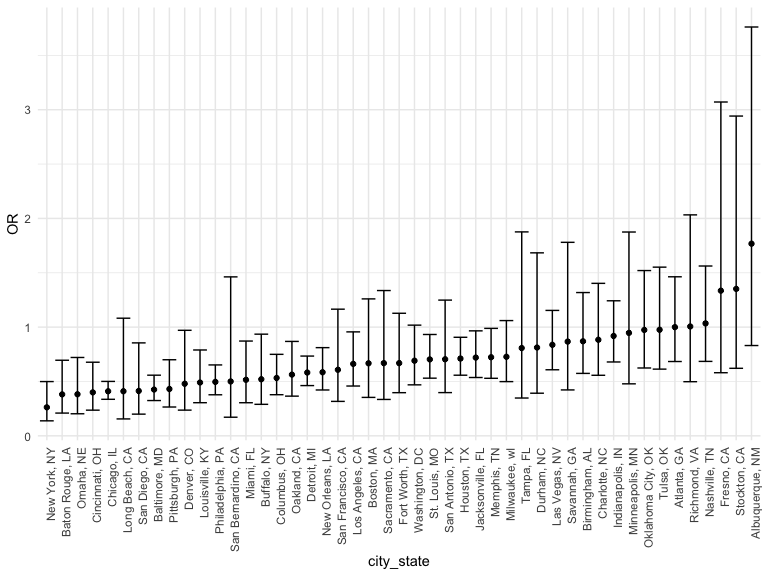
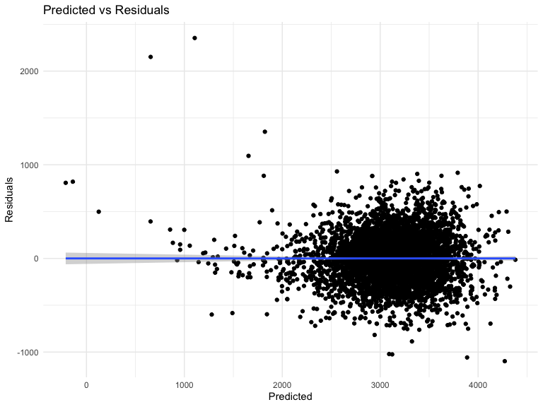

hw6\_p8105\_zl2978
================
Zhiye Lou
12/7/2020

# Problem 1

I will first read the data and start with one city.

``` r
homicide = 
  read_csv("data/homicide-data.csv", na = c("", "NA", "Unknown")) %>% 
  mutate(
    city_state = str_c(city, state, sep = ", "),
    victim_age = as.numeric(victim_age),
    resolution = case_when(
      disposition == "Closed without arrest" ~ 0,
      disposition == "Open/No arrest"        ~ 0,
      disposition == "Closed by arrest"      ~ 1)
  ) %>% 
  filter(
    victim_race %in% c("White", "Black"),
    city_state != "Tulsa, AL") %>% 
  select(city_state, resolution, victim_age, victim_race, victim_sex)
```

    ## Parsed with column specification:
    ## cols(
    ##   uid = col_character(),
    ##   reported_date = col_double(),
    ##   victim_last = col_character(),
    ##   victim_first = col_character(),
    ##   victim_race = col_character(),
    ##   victim_age = col_double(),
    ##   victim_sex = col_character(),
    ##   city = col_character(),
    ##   state = col_character(),
    ##   lat = col_double(),
    ##   lon = col_double(),
    ##   disposition = col_character()
    ## )

``` r
baltimore =
  homicide %>% 
  filter(city_state == "Baltimore, MD")
glm(resolution ~ victim_age + victim_race + victim_sex, 
    data = baltimore,
    family = binomial()) %>% 
  broom::tidy() %>% 
  mutate(
    OR = exp(estimate),
    CI_lower = exp(estimate - 1.96 * std.error),
    CI_upper = exp(estimate + 1.96 * std.error)
  ) %>% 
  select(term, OR, starts_with("CI")) %>% 
  knitr::kable(digits = 3)
```

| term              |    OR | CI\_lower | CI\_upper |
| :---------------- | ----: | --------: | --------: |
| (Intercept)       | 1.363 |     0.975 |     1.907 |
| victim\_age       | 0.993 |     0.987 |     1.000 |
| victim\_raceWhite | 2.320 |     1.648 |     3.268 |
| victim\_sexMale   | 0.426 |     0.325 |     0.558 |

Now I will do it for multiple cities and create a plot.

``` r
models_results_df = 
  homicide %>% 
  nest(data = -city_state) %>% 
  mutate(
    models = 
      map(.x = data, ~glm(resolution ~ victim_age + victim_race + victim_sex, data = .x, family = binomial())),
    results = map(models, broom::tidy)
  ) %>% 
  select(city_state, results) %>% 
  unnest(results) %>% 
  mutate(
    OR = exp(estimate),
    CI_lower = exp(estimate - 1.96 * std.error),
    CI_upper = exp(estimate + 1.96 * std.error)
  ) %>% 
  select(city_state, term, OR, starts_with("CI")) 
```

``` r
models_results_df %>% 
  filter(term == "victim_sexMale") %>% 
  mutate(city_state = fct_reorder(city_state, OR)) %>% 
  ggplot(aes(x = city_state, y = OR)) + 
  geom_point() + 
  geom_errorbar(aes(ymin = CI_lower, ymax = CI_upper)) + 
  theme(axis.text.x = element_text(angle = 90, hjust = 1))
```



# Problem 2

I will first read and tidy the data.

``` r
birthweight = 
  read_csv("./data/birthweight.csv") %>% 
  janitor::clean_names() %>% 
  mutate(babysex = recode(babysex, "1" = "male", "2" = "female"),
         frace = recode(frace, "1" = "White", "2" = "Black", "3" = "Asian", "4" = "Puerto Rican", "8" = "Other", "9" = "Unknown"),
         malform = recode(malform, "0" = "absent", "1" = "present"),
         mrace = recode(mrace, "1" = "White", "2" = "Black", "3" = "Asian", "4" = "Puerto Rican", "8" = "Other"))
```

    ## Parsed with column specification:
    ## cols(
    ##   .default = col_double()
    ## )

    ## See spec(...) for full column specifications.

``` r
number_of_na = sum(is.na(birthweight))
check_incomelete = sum(!complete.cases(birthweight))
```

I will first use a backward stepwise to choose my factors.

``` r
fit1 = 
  lm(bwt ~ ., data = birthweight) %>% 
  step(direction = "backward", trace = 0) 
fit1 %>% 
  broom::tidy() %>% 
  knitr::kable()
```

| term              |       estimate |   std.error |    statistic |   p.value |
| :---------------- | -------------: | ----------: | -----------: | --------: |
| (Intercept)       | \-6145.1506698 | 141.9496468 | \-43.2910599 | 0.0000000 |
| babysexmale       |   \-28.5580171 |   8.4548958 |  \-3.3776900 | 0.0007374 |
| bhead             |    130.7770408 |   3.4465672 |   37.9441440 | 0.0000000 |
| blength           |     74.9471109 |   2.0190479 |   37.1200270 | 0.0000000 |
| delwt             |      4.1067316 |   0.3920592 |   10.4747754 | 0.0000000 |
| fincome           |      0.3180229 |   0.1747477 |    1.8198980 | 0.0688436 |
| gaweeks           |     11.5924873 |   1.4620657 |    7.9288417 | 0.0000000 |
| mheight           |      6.5940377 |   1.7848817 |    3.6943835 | 0.0002231 |
| mraceBlack        |   \-63.9057046 |  42.3662612 |  \-1.5084103 | 0.1315225 |
| mracePuerto Rican |   \-25.7913672 |  45.3501537 |  \-0.5687162 | 0.5695783 |
| mraceWhite        |     74.8867755 |  42.3146313 |    1.7697608 | 0.0768374 |
| parity            |     96.3046933 |  40.3362158 |    2.3875490 | 0.0170038 |
| ppwt              |    \-2.6755853 |   0.4273585 |  \-6.2607517 | 0.0000000 |
| smoken            |    \-4.8434197 |   0.5855757 |  \-8.2712102 | 0.0000000 |

My predictors are babysex, bhead, blength, delwt, fincome, gaweeks,
mheight, mrace, parity, ppwt and smoken.  
My model was selected by using the backward stepwise, and then I will
make a plot of model residuals against fitted values.

``` r
birthweight %>% 
    add_predictions(fit1) %>% 
    add_residuals(fit1) %>% 
    ggplot(aes(x = pred, y = resid)) +
        geom_point()  + 
    geom_smooth() + 
    labs(title = "Predicted vs Residuals", 
       x = "Predicted", 
       y = "Residuals")
```

    ## `geom_smooth()` using method = 'gam' and formula 'y ~ s(x, bs = "cs")'


