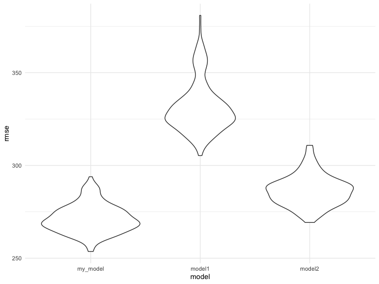
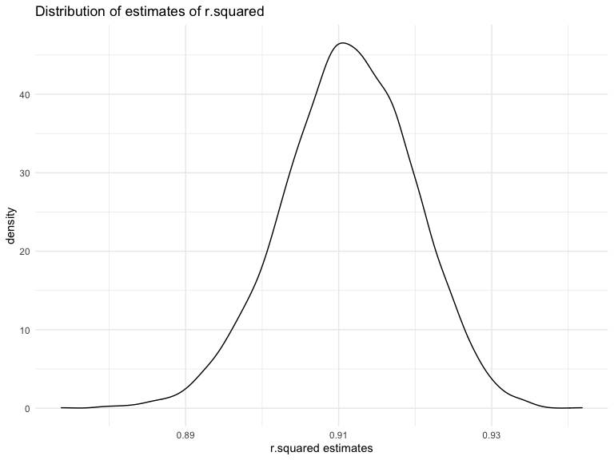
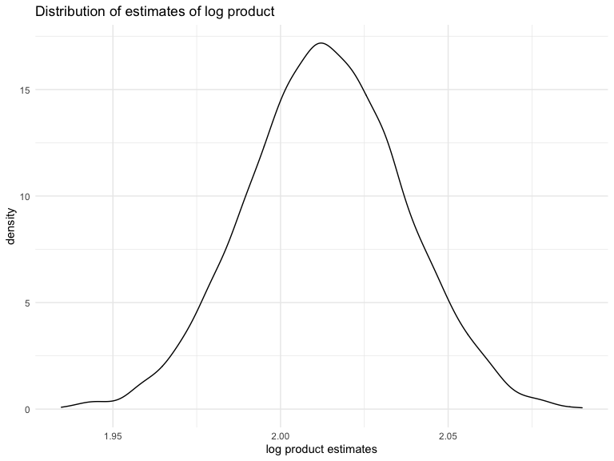

hw6\_p8105\_zl2978
================
Zhiye Lou
12/7/2020

# Problem 1

I will first read the data and start with one city.

``` r
homicide = 
  read_csv("data/homicide-data.csv", na = c("", "NA", "Unknown")) %>% 
  mutate(
    city_state = str_c(city, state, sep = ", "),
    victim_age = as.numeric(victim_age),
    resolution = case_when(
      disposition == "Closed without arrest" ~ 0,
      disposition == "Open/No arrest"        ~ 0,
      disposition == "Closed by arrest"      ~ 1)
  ) %>% 
  filter(
    victim_race %in% c("White", "Black"),
    city_state != "Tulsa, AL") %>% 
  select(city_state, resolution, victim_age, victim_race, victim_sex)
baltimore =
  homicide %>% 
  filter(city_state == "Baltimore, MD")
glm(resolution ~ victim_age + victim_race + victim_sex, 
    data = baltimore,
    family = binomial()) %>% 
  broom::tidy() %>% 
  mutate(
    OR = exp(estimate),
    CI_lower = exp(estimate - 1.96 * std.error),
    CI_upper = exp(estimate + 1.96 * std.error)
  ) %>% 
  select(term, OR, starts_with("CI")) %>% 
  knitr::kable(digits = 3)
```

| term              |    OR | CI\_lower | CI\_upper |
| :---------------- | ----: | --------: | --------: |
| (Intercept)       | 1.363 |     0.975 |     1.907 |
| victim\_age       | 0.993 |     0.987 |     1.000 |
| victim\_raceWhite | 2.320 |     1.648 |     3.268 |
| victim\_sexMale   | 0.426 |     0.325 |     0.558 |

Now I will do it for multiple cities and create a plot.

``` r
models_results_df = 
  homicide %>% 
  nest(data = -city_state) %>% 
  mutate(
    models = 
      map(.x = data, ~glm(resolution ~ victim_age + victim_race + victim_sex, data = .x, family = binomial())),
    results = map(models, broom::tidy)
  ) %>% 
  select(city_state, results) %>% 
  unnest(results) %>% 
  mutate(
    OR = exp(estimate),
    CI_lower = exp(estimate - 1.96 * std.error),
    CI_upper = exp(estimate + 1.96 * std.error)
  ) %>% 
  select(city_state, term, OR, starts_with("CI")) 
```

``` r
models_results_df %>% 
  filter(term == "victim_sexMale") %>% 
  mutate(city_state = fct_reorder(city_state, OR)) %>% 
  ggplot(aes(x = city_state, y = OR)) + 
  geom_point() + 
  geom_errorbar(aes(ymin = CI_lower, ymax = CI_upper)) + 
  theme(axis.text.x = element_text(angle = 90, hjust = 1))
```


# Problem 2

I will first read and tidy the data.

``` r
birthweight = 
  read_csv("./data/birthweight.csv") %>% 
  janitor::clean_names() %>% 
  mutate(babysex = recode(babysex, "1" = "male", "2" = "female"),
         frace = recode(frace, "1" = "White", "2" = "Black", "3" = "Asian", "4" = "Puerto Rican", "8" = "Other", "9" = "Unknown"),
         malform = recode(malform, "0" = "absent", "1" = "present"),
         mrace = recode(mrace, "1" = "White", "2" = "Black", "3" = "Asian", "4" = "Puerto Rican", "8" = "Other"))
number_of_na = sum(is.na(birthweight))
check_incomelete = sum(!complete.cases(birthweight))
```

I will first use a backward stepwise to choose my factors.

``` r
fit1 = 
  lm(bwt ~ ., data = birthweight) %>% 
  step(direction = "backward", trace = 0) 
fit1 %>% 
  broom::tidy() %>% 
  knitr::kable()
```

| term              |       estimate |   std.error |    statistic |   p.value |
| :---------------- | -------------: | ----------: | -----------: | --------: |
| (Intercept)       | \-6145.1506698 | 141.9496468 | \-43.2910599 | 0.0000000 |
| babysexmale       |   \-28.5580171 |   8.4548958 |  \-3.3776900 | 0.0007374 |
| bhead             |    130.7770408 |   3.4465672 |   37.9441440 | 0.0000000 |
| blength           |     74.9471109 |   2.0190479 |   37.1200270 | 0.0000000 |
| delwt             |      4.1067316 |   0.3920592 |   10.4747754 | 0.0000000 |
| fincome           |      0.3180229 |   0.1747477 |    1.8198980 | 0.0688436 |
| gaweeks           |     11.5924873 |   1.4620657 |    7.9288417 | 0.0000000 |
| mheight           |      6.5940377 |   1.7848817 |    3.6943835 | 0.0002231 |
| mraceBlack        |   \-63.9057046 |  42.3662612 |  \-1.5084103 | 0.1315225 |
| mracePuerto Rican |   \-25.7913672 |  45.3501537 |  \-0.5687162 | 0.5695783 |
| mraceWhite        |     74.8867755 |  42.3146313 |    1.7697608 | 0.0768374 |
| parity            |     96.3046933 |  40.3362158 |    2.3875490 | 0.0170038 |
| ppwt              |    \-2.6755853 |   0.4273585 |  \-6.2607517 | 0.0000000 |
| smoken            |    \-4.8434197 |   0.5855757 |  \-8.2712102 | 0.0000000 |

My predictors are babysex, bhead, blength, delwt, fincome, gaweeks,
mheight, mrace, parity, ppwt and smoken.  
My model was selected by using the backward stepwise, and then I will
make a plot of model residuals against fitted values.

``` r
birthweight %>% 
    add_predictions(fit1) %>% 
    add_residuals(fit1) %>% 
    ggplot(aes(x = pred, y = resid)) +
        geom_point()  + 
    geom_smooth(method = "lm") + 
    labs(title = "Predicted vs Residuals", 
       x = "Predicted", 
       y = "Residuals")
```


As we can see, the residuals are almost symmetrical to 0, and there is
no obvious relationship between the predicted value since the points are
clustered together and the line is almost flat.

Then I will compare my model to two other models.

``` r
## length at birth and gestational age as predictors (main effects only)
fit2 = lm(bwt ~ blength + gaweeks, data = birthweight) 
fit2 %>% 
  broom::tidy() %>% 
  knitr::kable()
```

| term        |     estimate | std.error |  statistic | p.value |
| :---------- | -----------: | --------: | ---------: | ------: |
| (Intercept) | \-4347.66707 | 97.958360 | \-44.38281 |       0 |
| blength     |    128.55569 |  1.989891 |   64.60439 |       0 |
| gaweeks     |     27.04673 |  1.717930 |   15.74379 |       0 |

``` r
## One using head circumference, length, sex, and all interactions (including the three-way interaction)
fit3 = lm(bwt ~ bhead * blength * babysex, data = birthweight) 
fit3 %>% 
  broom::tidy() %>% 
  knitr::kable()
```

| term                      |      estimate |    std.error |   statistic |   p.value |
| :------------------------ | ------------: | -----------: | ----------: | --------: |
| (Intercept)               |  \-801.948671 | 1102.3077046 | \-0.7275180 | 0.4669480 |
| bhead                     |   \-16.597546 |   34.0916082 | \-0.4868514 | 0.6263883 |
| blength                   |   \-21.645964 |   23.3720477 | \-0.9261475 | 0.3544209 |
| babysexmale               | \-6374.868351 | 1677.7669213 | \-3.7996150 | 0.0001469 |
| bhead:blength             |      3.324444 |    0.7125586 |   4.6655020 | 0.0000032 |
| bhead:babysexmale         |    198.393181 |   51.0916850 |   3.8830816 | 0.0001047 |
| blength:babysexmale       |    123.772887 |   35.1185360 |   3.5244319 | 0.0004288 |
| bhead:blength:babysexmale |    \-3.878053 |    1.0566296 | \-3.6702106 | 0.0002453 |

I will make the comparison by cross-validation.

``` r
cv_birthweight = 
    crossv_mc(birthweight, 200) %>% 
    mutate(
        train = map(train, as.tibble),
        test = map(test,as.tibble)
    ) %>% 
   mutate(
        my_model = map(train,~fit1),
        model1 = map(train,~fit2),
        model2 = map(train,~fit3)
    ) %>% 
    mutate(
        rmse_my_model = map2_dbl(my_model, test, ~rmse(model = .x,data = .y)),
        rmse_model1 = map2_dbl(model1, test, ~rmse(model = .x,data = .y)),
        rmse_model2 = map2_dbl(model2, test, ~rmse(model = .x,data = .y))
    )
cv_birthweight %>% 
  select(starts_with("rmse")) %>% 
  pivot_longer(
    everything(),
    names_to = "model", 
    values_to = "rmse",
    names_prefix = "rmse_") %>% 
  mutate(model = fct_inorder(model)) %>% 
  ggplot(aes(x = model, y = rmse)) + geom_violin()
```


As the plot shown, my\_model has the best distribution of RMSE, and the
model with main effect only has the worst distribution of RMSE.

# Problem 3

I will first read the data.

``` r
weather_df = 
  rnoaa::meteo_pull_monitors(
    c("USW00094728"),
    var = c("PRCP", "TMIN", "TMAX"), 
    date_min = "2017-01-01",
    date_max = "2017-12-31") %>%
  mutate(
    name = recode(id, USW00094728 = "CentralPark_NY"),
    tmin = tmin / 10,
    tmax = tmax / 10) %>%
  select(name, id, everything())
```

Then I will do the bootstrap.

``` r
boot_strap = 
  weather_df %>% 
  bootstrap(n = 5000) %>% 
  mutate(
    models = map(strap, ~lm(tmax ~ tmin, data = .x)),
    tidy_models = map(models, broom::tidy),
    glance_models = map(models, broom::glance)) %>% 
  unnest(tidy_models, glance_models) %>% 
  select(.id, term, estimate, r.squared) %>% 
    pivot_wider(
    names_from = term,
    values_from = estimate) %>% 
  rename(
    beta_0 = `(Intercept)`,
    beta_1 = tmin) %>% 
  
  mutate(log_beta = log(beta_0*beta_1)) %>% 
  select(r.squared, log_beta)
head(boot_strap)
```

    ## # A tibble: 6 x 2
    ##   r.squared log_beta
    ##       <dbl>    <dbl>
    ## 1     0.906     2.02
    ## 2     0.914     2.00
    ## 3     0.911     2.02
    ## 4     0.909     1.99
    ## 5     0.910     2.00
    ## 6     0.918     1.98

Then I will identify the 2.5% and 97.5% quantiles to provide a 95%
confidence interval for r.squared and log(β̂ 0∗β̂ 1).

``` r
quantile(boot_strap$r.squared, probs = c(0.025,0.975)) %>% 
  knitr::kable(caption = "95% CI for r.suqared")
```

|       |         x |
| :---- | --------: |
| 2.5%  | 0.8937457 |
| 97.5% | 0.9272915 |

95% CI for r.suqared

``` r
quantile(boot_strap$log_beta, probs = c(0.025,0.975)) %>% 
  knitr::kable(caption = "95% CI for log product")
```

|       |        x |
| :---- | -------: |
| 2.5%  | 1.967246 |
| 97.5% | 2.059363 |

95% CI for log product

I will plot the distribution of r squared estimates.

``` r
ggplot(data = boot_strap, aes(x = r.squared)) +
  geom_density() +
      labs(
        title = "Distribution of estimates of r.squared",
        x = "r.squared estimates")
```



I will then plot the distribution of log \(\beta 1\) \* \(\beta 2\)
estimates.

``` r
ggplot(data = boot_strap, aes(x = log_beta)) +
  geom_density() +
    labs(
        title = "Distribution of estimates of log product",
        x = "log product estimates")
```



As we can see, both the distributions of estimates of r squared and
log(beta0 \* beta1) are approximately normal distribution, and the r
squared with highest destiny is more than 0.9 which implies tmin is a
good indicator of tmax. Then reason r.squared is left tailed could be
the maximum value of r.squared is 1, and the mean is around 0.9.
